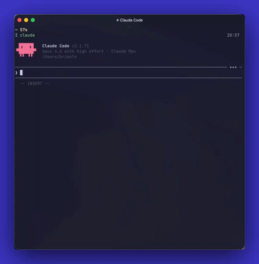

# dotagent.nvim

`dotagent.nvim` adds Claude Code and Codex-style `/command`, `/skill`, and
`/prompt` completion to your Ctrl+G prompt editor in Neovim, configured to your
local agent directories.

[](assets/dotagent-demo.mp4)

## Requirements

- Neovim 0.10+
- `saghen/blink.cmp`

## Release Status

The current recommended public tag is `v0.3.1`.

The plugin uses git tags for releases. There is no separate version file in the
repo.

## Features

- Scans native agent roots for `commands/`, `skills/`, and optional `prompts/`
- Supports explicit `command_dirs`, `skill_dirs`, and `prompt_dirs` overrides
- Provides a Blink source for `/command`, `/skill`, and `/prompt` completion
- Uses distinct Dotagent menu icons by default: `⚡` for commands, `󰧑` for
  skills, `󰘧` for prompts
- Auto-attaches only when the editor session is launched with
  `DOTAGENT_EDITOR_PROMPT=1`
- Supports manual `:DotagentAttach` and `:DotagentDetach`
- Includes `:DotagentRefresh`, `:DotagentBrowse`, and `:DotagentHealth`

## Install

Lazy example:

```lua
{
  "0xble/dotagent.nvim",
  config = function()
    require("dotagent").setup()
  end,
}
```

By default `dotagent.nvim` looks for native Codex and Claude roots:

- `~/.agent/shared`
- `~/.agent/runtimes/codex`
- `~/.agent/runtimes/claude`
- `~/.claude`

For each root it reads:

- `commands/*.md`
- `skills/*/SKILL.md`
- `prompts/*.md`, only when the `prompts/` folder exists

Blink setup:

```lua
{
  "saghen/blink.cmp",
  opts = function(_, opts)
    opts.sources = opts.sources or {}
    opts.sources.default = function()
      local sources = { "lsp", "path", "snippets" }
      if require("dotagent").is_buffer_enabled(0) then
        table.insert(sources, 1, "dotagent")
      elseif vim.bo.filetype ~= ""
        and vim.bo.filetype ~= "markdown"
        and vim.bo.filetype ~= "text"
        and vim.bo.filetype ~= "gitcommit"
      then
        table.insert(sources, "buffer")
      end
      return sources
    end

    opts.sources.providers = opts.sources.providers or {}
    opts.sources.providers.dotagent =
      require("dotagent.completion.blink").provider()
  end,
}
```

## Recommended Integration

The best integration is an external-editor flow where Claude Code or a Codex
launcher opens Neovim for prompt composition.

By default the plugin uses `/`, which is the more common command prefix in
editor and agent UIs.

Use one shared launcher for those flows:

```sh
#!/bin/sh
export DOTAGENT_EDITOR_PROMPT=1
exec nvim "$@"
```

Then point your agent surface at that launcher:

- Claude Code: configure its external editor, then use `Ctrl+G`
- Codex or an editor-backed wrapper like `ai`: set `EDITOR` to the same launcher

When Neovim starts with `DOTAGENT_EDITOR_PROMPT=1`, `dotagent.nvim` attaches
only to the initial prompt buffer. Additional buffers opened later in that
session stay unaffected.

## Default Behavior

Without `DOTAGENT_EDITOR_PROMPT=1`, the plugin does not auto-attach in regular
buffers.

The fallback path is manual:

- `:DotagentAttach`
- `:DotagentDetach`

That keeps slash completion out of normal code editing by default.

## Commands

- `:DotagentAttach [bufnr]`
- `:DotagentDetach [bufnr]`
- `:DotagentRefresh`
- `:DotagentBrowse`
- `:DotagentHealth`

## Configuration

```lua
require("dotagent").setup({
  icons = {
    command = "⚡",
    skill = "󰧑",
    prompt = "󰘧",
  },
  activation = {
    mode = "contextual",
    env_var = "DOTAGENT_EDITOR_PROMPT",
  },
  agent_dirs = {
    vim.fn.expand("~/.claude"),
  },
  sources = {
    {
      type = "items",
      items = {
        {
          name = "ship",
          kind = "command",
          description = "Example Lua-defined item",
        },
      },
    },
  },
})
```

If your agent root has a custom prompt folder, `dotagent.nvim` reads it
automatically:

```text
~/.claude/
  commands/
  skills/
  prompts/
```

Use per-type overrides when one kind lives elsewhere:

```lua
require("dotagent").setup({
  agent_dirs = {
    vim.fn.expand("~/.claude"),
  },
  prompt_dirs = {
    vim.fn.expand("~/custom-prompts"),
  },
})
```

Legacy `sources` path definitions still work. If you provide `agent_dirs`,
`command_dirs`, `skill_dirs`, or `prompt_dirs`, those directory lists become the
authoritative path configuration for their type, while `items` sources still
merge normally.

`icons` is optional. Override either kind if you want a different
source-specific menu icon, or set a value to `""` to fall back to Blink's normal
kind icon for
that item kind.

If you want a different prefix, override it explicitly.

My setup keeps `$`:

```lua
require("dotagent").setup({
  prefixes = { "$" },
  activation = {
    mode = "contextual",
    env_var = "DOTAGENT_EDITOR_PROMPT",
  },
  command_dirs = {
    vim.fn.expand("~/.claude/commands"),
  },
  skill_dirs = {
    vim.fn.expand("~/.claude/skills"),
  },
})
```

`activation.mode` values:

- `"contextual"`: attach only when launched with the editor prompt env marker
- `"manual"`: never auto-attach
- `"global"`: enable in every non-terminal buffer
